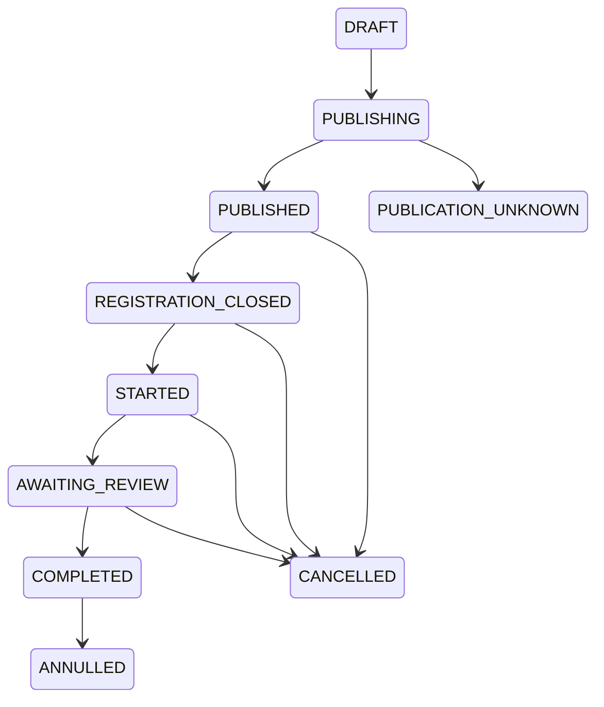

# JR-Foxy: `/event` і рейтинг надійності

Технічна специфікація v1.1  
Статус: погоджено для реалізації  
Дата: 4 вересня 2026 року  
Часова зона: `Europe/Kyiv`

## 1. Мета

Функція `/event` забезпечує повний цикл подій JokerRecon:

- створення й редагування події адміністрацією;
- публікацію в головному чаті JokerRecon;
- відповіді гравців «Я — учасник», «Відмовляюся», «Думаю»;
- автоматичні та ручні нагадування;
- перевірку фактичної присутності;
- розрахунок і відображення рейтингу надійності.

Рейтинг оцінює виконання добровільно підтвердженого зобов’язання, а не загальну активність гравця.

### 1.1. Поза межами першої версії

- автоматичне визначення присутності за грою, голосовим чатом або зовнішнім API;
- резервний список понад 50 учасників;
- автоматичне формування команд;
- особисті повідомлення про зарахований результат;
- імпорт старих подій до рейтингу;
- ручне додавання гравця до учасників адміністрацією.

## 2. Незмінні правила та строки

| Параметр | Значення |
|---|---:|
| Мінімальний строк створення | не менше 24 годин до початку |
| Автоматичне нагадування | `T−3 години` |
| Межа безпечної відмови | `T−2 години` |
| Закриття нової реєстрації | `T−1 година` |
| Блокування всіх відповідей | у момент `T` |
| Створення перевірки присутності | `T+1 година` |
| Перше нагадування про незавершену перевірку | через 6 годин після її створення |
| Наступні нагадування про перевірку | кожні 24 години до завершення |
| Cooldown ручних нагадувань | 60 хвилин |
| Підтвердження пізньої відмови | повторне натискання протягом 60 секунд |
| Максимум учасників | 50 |
| Сторінка перевірки | 10 гравців |
| Строк життя чернетки | 48 годин після останньої дії |
| Вікно рейтингу | останні 12 оцінених подій гравця |
| Вихід із сірої зони | після 3 оцінених подій |
| Чат публікації | один заздалегідь визначений головний чат JokerRecon |

`T` — дата й час початку події.

Усі моменти зберігаються як UTC timestamp. Ввід, показ і порівняння для користувача виконуються в `Europe/Kyiv`.

## 3. Ролі та права

| Дія | Гравець | Рівень 1–2 | Рівень 3 | Рівень 4 |
|---|:---:|:---:|:---:|:---:|
| Відповісти на активну подію | так | так | так | так |
| Побачити короткий рейтинг у чужому `/profile` | так | так | так | так |
| Побачити власну `/reliability` | так | так | так | так |
| Побачити чужу `/reliability` | ні | ні | так | так |
| Відкрити `/event` в адмін-чаті | ні | ні | так | так |
| Створити, редагувати, скасувати подію до початку | ні | ні | так | так |
| Надіслати ручне нагадування | ні | ні | так | так |
| Спільно заповнювати перевірку | ні | ні | так | так |
| Скасувати подію після початку до фіналізації | ні | ні | так | так |
| Виправити результат після фіналізації | ні | ні | до 24 годин | будь-коли |
| Змінювати поля після початку до фіналізації | ні | ні | ні | так |
| Змінювати поля після фіналізації | ні | ні | ні | ні |
| Анулювати фіналізовану подію | ні | ні | ні | так |

Додаткові правила:

- керування доступне лише в адмін-чаті, навіть за наявності потрібного рівня;
- будь-який адміністратор рівня 3–4 може керувати подією, створеною іншим адміністратором;
- адміністрація не має обмежень щодо оцінювання власного результату;
- кожна адміністративна дія записується до незмінного аудиту.

## 4. Життєвий цикл події

| Стан | Значення | Дозволені переходи |
|---|---|---|
| `DRAFT` | Чернетка одного адміністратора | `PUBLISHING`, видалення |
| `PUBLISHING` | Зарезервована спроба публікації | `PUBLISHED`, `PUBLICATION_UNKNOWN`, назад у `DRAFT` при явній помилці |
| `PUBLICATION_UNKNOWN` | Бот не знає, чи Telegram прийняв повідомлення | ручне відновлення або скасування |
| `PUBLISHED` | Подія активна, нова реєстрація відкрита | `REGISTRATION_CLOSED`, `CANCELLED` |
| `REGISTRATION_CLOSED` | Нові учасники не приймаються | `STARTED`, `CANCELLED` |
| `STARTED` | Відповіді гравців заблоковані | `AWAITING_REVIEW`, `CANCELLED` |
| `AWAITING_REVIEW` | Перевірка створена, але не завершена | `COMPLETED`, `CANCELLED` |
| `COMPLETED` | Результати фіналізовані | корекція результатів, `ANNULLED` рівнем 4 |
| `CANCELLED` | Подія скасована й не впливає на рейтинг | кінцевий стан |
| `ANNULLED` | Результати завершеної події вилучені з рейтингу | кінцевий стан |

Окремий прапорець `publication_missing` позначає видалене публічне повідомлення. Він не змінює бізнес-стан і не скидає відповіді або таймери.



## 5. Адмін-меню `/event`

Команда відкриває персональне повідомлення-панель:

```text
📅 Керування подіями

Майбутніх подій: {upcoming_count}
Очікують перевірки: {review_count}

[➕ Створити нову подію]
[✏️ Редагувати існуючу подію]
[🚫 Скасувати подію]
[🔔 Надіслати нагадування]
[📋 Незавершені перевірки]
```

Правила панелі:

- кожен адміністратор отримує власну панель;
- callback чужої панелі відхиляється приватним повідомленням;
- навігація відбувається редагуванням одного повідомлення бота;
- введені адміністратором тексти видаляються одразу після обробки;
- якщо бот не має права видалення, дія все одно виконується, а панель показує службове попередження;
- списки подій сортуються від найближчої до найпізнішої та мають пагінацію по 10.

Фідбек чужої панелі:

```text
Це меню належить іншому адміністратору. Використайте власну команду /event.
```

## 6. Створення події

### 6.1. Чернетка

- Один адміністратор може мати одну активну чернетку.
- Чернетка зберігається в SQLite та переживає перезапуск.
- Строк 48 годин поновлюється після кожної дії.
- За наявності чернетки бот пропонує «Продовжити» або «Видалити й створити нову».
- Видалення чернетки потребує повторного підтвердження.
- Спливла чернетка видаляється ліниво при наступному зверненні й періодичним cleanup job.

### 6.2. Редагована форма

```text
📝 Створення події

Назва: {title або ⚠️ не вказана}
Тип: {type або ⚠️ не вибрано}
Дата: {date або ⚠️ не вибрана}
Час: {time або ⚠️ не вказаний}
Опис: {description або не додано}

[📝 Назва] [🏷 Тип]
[📅 Дата] [🕒 Час]
[📄 Опис]
[👁 Попередній перегляд]
[✅ До публікації]
[🗑 Видалити чернетку] [↩️ Назад]
```

Поля можна заповнювати в будь-якому порядку.

| Поле | Обов’язкове | Правило |
|---|:---:|---|
| Назва | так | 3–100 символів; trim; повторні пробіли стискаються; HTML екранується |
| Тип | так | `кланова`, `міжкланова`, `публічна`; лише інформаційна позначка |
| Дата | так | вибір inline-календарем |
| Час | так | текст `ГГ:ХХ`; секунди завжди `00` |
| Опис | ні | 1–1000 символів; порожнє поле не показується |

Дата й час повинні утворювати реальний локальний момент, бути не раніше ніж через 24 години та не конфліктувати з іншою активною подією.

### 6.3. Конфлікт часу

Конфліктом є однакова дата й хвилина початку двох активних подій. Тривалість події не враховується.

Конфлікт створюють стани `PUBLISHING`, `PUBLICATION_UNKNOWN`, `PUBLISHED`, `REGISTRATION_CLOSED`, `STARTED`, `AWAITING_REVIEW`. Чернетки, скасовані, завершені й анульовані події конфлікту не створюють.

Публікація або перенесення на зайняту хвилину блокується:

```text
На цей час уже заплановано подію «{conflicting_title}». Виберіть іншу дату або час.
```

### 6.4. Попередній перегляд і публікація

Публікація двоетапна:

1. Бот повторно перевіряє всі поля й показує точний попередній вигляд.
2. Адміністратор натискає «Опублікувати в JokerRecon» або повертається до редагування.
3. Перед фактичною відправкою бот повторно перевіряє права, мінімум 24 години й конфлікт часу.
4. Подія резервується в БД до звернення до Telegram.
5. Повторне натискання не створює дубль.

Якщо бот аварійно зупинився між надсиланням і збереженням `message_id`, автоматичного повтору немає. Подія отримує `PUBLICATION_UNKNOWN`, а адміністрація — окрему дію для перевірки та відновлення. Пріоритет: без дублів, можливий пропуск.

## 7. Публічна картка

### 7.1. Активна подія

```text
📅 Подія «Тренування КБ»

Тип: кланова
Дата та час: 5 жовтня 2026 року о 21:00 (понеділок)
Опис: тренування командної взаємодії.
Крайній безпечний термін реєстрації до: 5 жовтня 2026 року о 19:00
Реєстрація закривається: 5 жовтня 2026 року о 20:00

Учасники: 3/50
1. JRঐPlayer
2. JRঐMonax
3. JRঐFoxy

Думають: 2
Відмовилися від участі: 1

[✅ Я — учасник] [❌ Відмовляюся] [🤔 Думаю]
```

Правила рендерингу:

- кожен учасник показується з нового рядка;
- порядок — за часом поточної реєстрації;
- повторна реєстрація після виходу ставить гравця в кінець;
- видимий текст — актуальний ігровий нік до фіналізації;
- якщо актуальний нік тимчасово недоступний, використовується snapshot реєстрації;
- нік є HTML-посиланням `tg://user?id={telegram_id}`;
- для «Думаю» й «Відмовляюся» показуються лише кількості;
- картка завжди будується з committed-стану БД;
- успішна зміна статусу редагує картку, але не створює повідомлення в чаті.

### 7.2. Скасована подія

```text
❌ Подію «{title}» скасовано

Дата та час: {localized_datetime}
Причина: {reason}
```

Оригінальна картка редагується, кнопки прибираються. Окремою відповіддю бот повідомляє причину та згадує поточних учасників і тих, хто думає.

### 7.3. Завершена подія

Після фіналізації список ніків прибирається:

```text
✅ Подію «{title}» завершено

Тип: {type}
Дата та час: {localized_datetime}

Присутні: {present}
Не з’явилися: {no_show}
Пізно відмовилися: {late_decline}
Не враховано: {excluded}
```

Персональні результати в головному чаті не публікуються. Окреме повідомлення про завершення не надсилається.

## 8. Відповіді гравців

### 8.1. Допустимі переходи

| Період | «Я — учасник» | «Думаю» | «Відмовляюся» |
|---|---|---|---|
| До `T−2` | дозволено за наявності профілю й ніку; максимум 50 | дозволено всім | дозволено всім; без рейтингу |
| `T−2 ≤ now < T−1` | нова й повторна реєстрація дозволені за наявності місця | дозволено, крім переходу чинного учасника | для чинного учасника — пізня відмова з подвійним підтвердженням |
| `T−1 ≤ now < T` | заборонено | заборонено | дозволено лише чинному учаснику як пізня відмова |
| `now ≥ T` | заборонено | заборонено | заборонено |

Границі застосовуються включно: рівно в `T−2` відмова вже пізня; рівно в `T−1` нова реєстрація вже закрита; рівно в `T` усі відповіді заблоковані.

### 8.2. Загальні правила

- На подію існує одна поточна відповідь користувача.
- «Я — учасник» вимагає запису профілю та непорожнього `game_nickname`.
- «Думаю» і первинна відмова не вимагають профілю або ігрового ніку.
- Учасником може бути лише користувач головного чату JokerRecon.
- Статус «Думаю» не резервує місце.
- 51-й учасник не реєструється; перевірка місткості й запис виконуються атомарно.
- Вихід учасника до початку звільняє місце.
- Повторне натискання поточного статусу нічого не змінює й не пересуває гравця у списку.
- До лічильника відмов входять усі користувачі з поточною відмовою.
- Пізня відмова виникає лише в користувача, який безпосередньо перед цим був учасником.
- Перехід учасника в «Думаю» після `T−2` заборонено, а не перетворюється на відмову.
- Після пізньої відмови можна повторно зареєструватися до `T−1`, якщо є місце.
- Повторна реєстрація прибирає попередній результат пізньої відмови; остаточно оцінюється присутність.
- Вихід із чату або архівація профілю не прибирає вже підтверджене зобов’язання.

### 8.3. Завершення статусу «Думаю»

У момент `T−1` усі поточні статуси `THINKING` переводяться у `THINKING_EXPIRED`:

- не входять до рейтингу;
- не входять до перевірки;
- прибираються з публічного лічильника «Думають»;
- зберігаються в аудиті як інформаційний факт.

### 8.4. Пізня відмова

1. Перше натискання «Відмовляюся» після `T−2` не змінює статус.
2. Бот створює підтвердження на 60 секунд і показує суворе попередження.
3. Друге натискання того самого користувача в тій самій події фіксує `LATE_DECLINED`.
4. Після 60 секунд підтвердження спливає; наступне натискання знову є першим.
5. Будь-яка інша успішна зміна стану анулює відкрите підтвердження.
6. У перевірці результат `LATE_DECLINE` виставляється автоматично, але рівень 3–4 може змінити його до фіналізації.

## 9. Приватний фідбек кнопок

Успіх показується короткою Telegram-плашкою (`show_alert=False`). Помилки, строки та рейтингові наслідки — модальним вікном (`show_alert=True`). Повідомлення в групу не створюються.

| Ситуація | Текст |
|---|---|
| Участь підтверджено | `✅ Твій статус: «Я — учасник».` |
| Статус «Думаю» | `🤔 Твій статус: «Думаю».` |
| Звичайна відмова | `❌ Твій статус: «Відмовляюся».` |
| Пізню відмову завершено | `⚠️ Пізню відмову підтверджено.` |
| Такий статус уже є | `Цей статус уже встановлено.` |
| Немає профілю або ніку | `Неможливо підтвердити участь. Заповніть спершу свій профіль /profile.` |
| Ліміт | `У події вже зареєстровано максимальну кількість учасників — 50.` |
| Реєстрацію закрито | `Реєстрацію на подію вже завершено. Змінити статус неможливо.` |
| Подія почалася | `Подія вже розпочалася. Змінювати відповідь більше не можна.` |
| Учасник натискає «Думаю» після `T−2` | `Після завершення безпечного терміну статус «Думаю» недоступний. Якщо ви не зможете бути присутні — скористайтеся кнопкою «Відмовляюся».` |
| Перше натискання пізньої відмови | `Увага. Безпечний термін минув. Відмова буде зарахована як половина пропуску. Натисніть «Відмовляюся» ще раз протягом 60 секунд для підтвердження.` |
| Підтвердження спливло | `Час підтвердження минув. Натисніть «Відмовляюся» ще раз, якщо хочете продовжити.` |
| Подію скасовано | `Подію скасовано. Відповіді більше не приймаються.` |
| Картка застаріла | `Стан події вже змінився. Відкрийте актуальну картку.` |

### 9.1. Системні тексти адміністративних сценаріїв

Ці повідомлення показуються в персональній панелі, якщо для конкретного випадку не зазначено інше.

| Ситуація | Текст |
|---|---|
| Немає доступу | `Керування подіями доступне лише адміністрації рівня 3–4 в адмін-чаті.` |
| Назва некоректна | `Назва події повинна містити від 3 до 100 символів.` |
| Час некоректний | `Введіть реальний час у форматі ГГ:ХХ, наприклад 21:00.` |
| Менше 24 годин | `Подію потрібно запланувати щонайменше за 24 години. Найраніший доступний час: {localized_datetime}.` |
| Не заповнені поля | `Неможливо перейти до публікації. Заповніть назву, тип, дату й час.` |
| Конфлікт старту | `На цей час уже заплановано подію «{conflicting_title}». Виберіть іншу дату або час.` |
| Чернетка спливла | `Чернетку видалено після 48 годин без дій. Створіть нову подію.` |
| Немає права видаляти ввід | `Дані збережено, але бот не зміг видалити ваше повідомлення. Перевірте право «Видалення повідомлень».` |
| Публікація успішна | `Подію «{title}» опубліковано в головному чаті JokerRecon.` |
| Невизначена публікація | `Не вдалося підтвердити результат публікації. Автоматичного повтору не буде, щоб не створити дубль.` |
| Конкурентне редагування | `Подію вже змінив інший адміністратор. Завантажено актуальні дані — перевірте їх перед повторним збереженням.` |
| Збережено звичайне редагування | `Зміни події «{title}» збережено.` |
| Попередження перенесення | `Зміна дати або часу скине всі відповіді та попросить гравців зареєструватися повторно.` |
| Запит причини скасування | `Надішліть коротку причину скасування одним повідомленням — від 3 до 300 символів.` |
| Причина некоректна | `Причина повинна містити від 3 до 300 символів.` |
| Скасування успішне | `Подію «{title}» скасовано. Відповіді та результати не впливатимуть на рейтинг.` |
| Cooldown нагадування | `Нагадування вже надсилалося. Повторне надсилання буде доступне о {time}.` |
| Порожня аудиторія | `Нагадування не надіслано: у вибраній групі немає користувачів.` |
| Нагадування успішне | `Нагадування про подію «{title}» надіслано. Згадано користувачів: {count}.` |
| Запит нейтральної причини | `Надішліть коротке пояснення, чому результат {nickname} не потрібно враховувати — від 3 до 300 символів.` |
| Є неоцінені гравці | `Неможливо завершити перевірку. Не оцінено гравців: {count}.` |
| Фіналізація успішна | `Перевірку завершено. Результати збережено, рейтинги перераховано.` |
| Вікно корекції спливло | `24 години після фіналізації минули. Подальша корекція доступна лише адміністрації рівня 4.` |
| Публікацію втрачено | `Повідомлення активної події не знайдено. Опублікуйте картку повторно або скасуйте подію.` |

## 10. Нагадування

### 10.1. Автоматичне нагадування `T−3`

Надсилається один раз відповіддю на картку події. Містить окремі блоки:

- підтверджені учасники;
- користувачі зі статусом «Думаю».

Для згадки використовується актуальний ігровий нік; якщо його немає — Telegram-ім’я. Порожній блок не показується. Якщо обидві групи порожні, нагадування пропускається з аудитом.

```text
🔔 Нагадування про подію «{title}»

Початок сьогодні о {time} — залишилося 3 години.

Підтвердили участь:
{participants_mentions}

Ще думають:
{thinking_mentions}

До завершення безпечного терміну залишилася 1 година.
Реєстрація закриється о {registration_close_time}.
```

Після перезапуску пропущене нагадування надсилається лише якщо реєстрація ще відкрита. Інакше воно позначається пропущеним.

### 10.2. Ручне нагадування

Рівень 3–4 щоразу обирає:

- учасникам;
- тим, хто думає;
- обом групам.

Повідомлення надсилається відповіддю на подію в головному чаті. Повторне ручне нагадування для тієї самої події доступне не раніше ніж через 60 хвилин. Після `T−1` аудиторія «Думають» порожня; після `T` ручні нагадування недоступні.

## 11. Редагування й перенесення

- Редагування відкриває копію поточних даних із `base_version`.
- Зміни накопичуються й застосовуються разом кнопкою «Зберегти зміни».
- «Скасувати редагування» не змінює публічну подію.
- Якщо версія змінилася, збереження блокується та завантажується актуальний стан.
- Назва, тип і опис редагуються без окремого повідомлення в головний чат.
- Зміна дати або часу скидає всі відповіді, попередні результати й підтвердження пізньої відмови.
- Після перенесення бот переплановує всі jobs і окремою відповіддю згадує всіх, чиї відповіді скинуто.
- Старе автоматичне нагадування редагується як неактуальне, якщо це технічно можливо.

Новий час після перенесення завжди повинен бути щонайменше через 24 години й не конфліктувати з активною подією. Це правило діє також для рівня 4 після початку.

До фіналізації рівень 4 може змінити будь-яке поле. Після фіналізації метадані події заблоковані для всіх; доступні лише корекція результатів або анулювання.

## 12. Скасування, анулювання та втрачена публікація

### 12.1. Ручне скасування

- До початку: рівні 3–4.
- Після початку й до фіналізації: рівні 3–4.
- Після фіналізації: тільки анулювання рівнем 4.
- Причина обов’язкова, 3–300 символів.
- Скасування потребує повторного підтвердження.
- Усі результати події виключаються з рейтингу.

### 12.2. Автоматичне скасування

У момент `T` подія автоматично скасовується, якщо одночасно:

- немає поточних учасників;
- немає користувачів із підтвердженою пізньою відмовою.

Системна причина: `Подію автоматично скасовано: немає зареєстрованих учасників.`

### 12.3. Анулювання

Рівень 4 може анулювати завершену подію будь-коли. Причина 3–300 символів обов’язкова. Анулювання вилучає всі результати цієї події та динамічно перераховує 12-подійні вікна гравців.

### 12.4. Видалене повідомлення

Telegram Bot API не надсилає боту update про видалення звичайного повідомлення. Тому окремого polling кожні 15 хвилин немає.

Втрата картки визначається під час найближчої взаємодії, редагування, нагадування або іншої операції з `message_id`. Адмін-чат отримує:

```text
⚠️ Повідомлення активної події «{title}» не знайдено в головному чаті.

[📢 Опублікувати повторно]
[🚫 Скасувати подію]
```

Повторна публікація зберігає відповіді, результати й таймери. При конкурентних діях перемагає перша committed-транзакція.

## 13. Перевірка присутності

### 13.1. Створення

Через годину після початку бот створює в адмін-чаті перевірку для:

- усіх, хто мав статус учасника в момент `T`;
- усіх, хто підтвердив пізню відмову й не зареєструвався повторно.

Гравець, який залишив головний чат, не вилучається з перевірки.

### 13.2. Інтерфейс

- 10 гравців на сторінці;
- у тексті — пронумеровані клікабельні ніки;
- у кнопках — номер і результат;
- унизу — навігація та прогрес `Оцінено {done} із {total}`;
- кілька адміністраторів рівня 3–4 працюють спільно;
- остання оцінка до фіналізації перемагає;
- кожна проміжна зміна записується в аудит без обов’язкового коментаря.

Легенда результатів:

- `✅ PRESENT` — присутній;
- `❌ NO_SHOW` — не з’явився;
- `🕒 LATE_DECLINE` — пізня відмова;
- `➖ EXCLUDED` — не враховувати.

Підтверджена пізня відмова попередньо заповнюється автоматично. Інші результати обирає адміністрація.

### 13.3. «Не враховувати»

- Після кнопки бот просить коротку причину.
- Довжина: 3–300 символів після trim.
- Без причини результат не змінюється.
- Причину бачить сам гравець у `/reliability` та адміністрація.
- Особа адміністратора доступна тільки в аудиті.

### 13.4. Фіналізація

- Кнопка недоступна, поки хоча б один гравець не має результату.
- Перше натискання показує зведення результатів і кількість рейтингів, що зміняться.
- Друге натискання того самого адміністратора фіналізує перевірку.
- Повторна або конкурентна фіналізація є ідемпотентною.
- До фіналізації рейтинг не змінюється.
- Після фіналізації картка в головному чаті отримує загальні підсумки без імен.
- Окремі повідомлення гравцям не надсилаються.

### 13.5. Нагадування адміністрації

Якщо перевірка не завершена:

1. через 6 годин бот надсилає нагадування;
2. далі — кожні 24 години;
3. нагадування тривають до фіналізації або скасування;
4. результати автоматично не виставляються.

### 13.6. Корекції

- Рівень 3–4: протягом 24 годин після фіналізації.
- Рівень 4: без обмеження строку.
- Кожна корекція потребує причини 3–300 символів.
- Зберігаються старий і новий результат, причина, виконавець і час.
- Рейтинг перераховується динамічно; окремого повідомлення гравцю немає.

## 14. Рейтинг надійності

Позначення:

- `A` — присутність (`PRESENT`);
- `P` — неявка (`NO_SHOW`);
- `L` — пізня відмова (`LATE_DECLINE`).

Формула:

```text
reliability = A / (A + P + 0.5 × L) × 100%
```

Правила:

- використовуються останні 12 оцінених подій конкретного гравця за часом початку;
- якщо їх менше 12 — усі наявні;
- `EXCLUDED`, `CANCELLED` і `ANNULLED` не входять до вікна та не займають місце;
- рейтинг не зберігається як джерело істини, а обчислюється з результатів;
- відсоток рахується з повною точністю й округлюється до цілого за `ROUND_HALF_UP`;
- зона визначається за вже округленим числом;
- історія безстроково прив’язана до Telegram ID;
- зміна ніку, вихід із клану, архівація профілю та повторний вступ історію не скидають.

| Зона | Умова |
|---|---|
| ⚪ Сіра | менше 3 оцінених подій |
| 🟢 Зелена | 70–100% |
| 🟡 Жовта | 40–69% |
| 🔴 Червона | 0–39% |

## 15. `/profile` і `/reliability`

### 15.1. `/profile`

Короткий рядок бачать усі користувачі, які можуть відкрити профіль:

```text
🟢 Надійність: 83% · враховано 12 подій
```

До трьох оцінених подій:

```text
⚪ Надійність: недостатньо даних · 2 із 3 подій
```

У профіль не додаються окремі лічильники результатів або історія.

### 15.2. `/reliability`

- Гравець переглядає лише власну детальну статистику.
- Рівні 3–4 можуть переглядати будь-якого гравця командою у reply, за `@username` або Telegram ID.
- Пошук за ігровим ніком не є основним ключем через можливі дублікати та зміни.
- У загальних чатах власну деталізацію не публікувати; бот дає кнопку відкриття приватного чату.
- Адміністративний перегляд дозволений лише в адмін-чаті.

```text
📊 Статистика надійності

Гравець: {nickname}
Рейтинг: 🟢 83%
Основа: останні 12 оцінених подій

✅ Присутність: 8
🕒 Пізні відмови: 2
❌ Неявки: 1

Останні 5 подій:
✅ 5 жовтня — «Тренування КБ»
🕒 2 жовтня — «Міжкланова кастомка»
➖ 28 вересня — «Тренування складу»
❌ 20 вересня — «Кланова битва»
```

Для `EXCLUDED` одразу під подією показується причина. Останні п’ять записів можуть містити нейтральні результати, хоча вони не входять до рейтингового вікна.

Після фіналізації історичний запис зберігає актуальний на той момент ігровий нік. Подальша зміна профілю не переписує історію.

## 16. Модель даних

Наведена схема логічна; точний SQL має бути ідемпотентною міграцією без втрати чинних даних.

### 16.1. `events`

Основні поля:

```text
id, title, event_type, description,
starts_at_utc, safe_until_utc, registration_closes_at_utc,
status, created_by, created_at, updated_at,
review_created_at, finalized_at,
cancel_reason, cancelled_by, cancelled_at,
annul_reason, annulled_by, annulled_at,
version
```

Обов’язкові індекси:

- активні події за `starts_at_utc`;
- події за `status` і `starts_at_utc`;
- optimistic locking за `id + version`;
- унікальне резервування однакової хвилини початку для активних станів.

### 16.2. `event_publications`

```text
id, event_id, chat_id, message_id,
is_current, published_at, missing_at, invalidated_at
```

Зберігає історію первинної й повторних публікацій. Для події може бути лише одна поточна публікація.

### 16.3. `event_responses`

```text
event_id, user_id, status,
nickname_snapshot, telegram_name_snapshot,
joined_at, responded_at, updated_at
```

`UNIQUE(event_id, user_id)`. Допустимі статуси: `GOING`, `THINKING`, `DECLINED`, `LATE_DECLINED`, `THINKING_EXPIRED`.

`joined_at` оновлюється при кожному новому вході до статусу `GOING`, щоб повторна реєстрація переміщувала гравця в кінець.

### 16.4. `event_late_confirmations`

```text
event_id, user_id, expires_at, created_at
```

`UNIQUE(event_id, user_id)`. Спливлі записи видаляються ліниво; на правильність рішення впливає тільки порівняння `expires_at` у транзакції.

### 16.5. `event_results`

```text
event_id, user_id, result, exclusion_reason,
nickname_snapshot, source,
marked_by, marked_at, finalized_at,
corrected_by, corrected_at, correction_reason
```

`UNIQUE(event_id, user_id)`. Допустимі результати: `PRESENT`, `NO_SHOW`, `LATE_DECLINE`, `EXCLUDED`.

### 16.6. `event_drafts`

```text
admin_id, draft_kind, target_event_id, base_version,
payload_json, menu_chat_id, menu_message_id,
created_at, updated_at, expires_at
```

`admin_id` — первинний ключ: одна чернетка на адміністратора.

### 16.7. `event_notifications`

```text
id, event_id, kind, audience,
dedupe_key, scheduled_at, reserved_at,
sent_at, skipped_at, status, telegram_message_id, error
```

`dedupe_key` унікальний. Стани: `PENDING`, `RESERVED`, `SENT`, `SKIPPED`, `FAILED`.

### 16.8. `event_audit_log`

```text
id, event_id, actor_id, action,
old_value_json, new_value_json,
reason, created_at
```

Таблиця append-only. Вона не використовується безпосередньо у формулі рейтингу.

## 17. Планувальник та відмовостійкість

### 17.1. Типи jobs

- `event_auto_reminder` — `T−3`;
- `event_registration_close` — `T−1`;
- `event_start` — `T`;
- `event_review_create` — `T+1`;
- `event_review_reminder_6h`;
- `event_review_reminder_daily`;
- `event_draft_cleanup`.

Межа `T−2` перевіряється при кожному callback за поточним часом; окремий job для неї не потрібний.

### 17.2. Обов’язкове посилення чинного `scheduled_tasks`

Додати:

- `dedupe_key TEXT UNIQUE`;
- `locked_at INTEGER`;
- `max_attempts INTEGER`;
- відновлення завислих `RUNNING` після lease timeout;
- атомарне захоплення job;
- окремі політики retry для Telegram rate limit, явної помилки та невизначеної доставки.

### 17.3. Гарантія нагадувань

Telegram не підтримує idempotency key для `sendMessage`. Тому гарантія — **без дублів, можливий рідкісний пропуск**:

1. перед Telegram-викликом доставка резервується в БД;
2. після успіху зберігається `message_id` і `SENT`;
3. якщо процес падає у невизначеному вікні, `RESERVED` автоматично не повторюється;
4. випадок записується в аудит і показується адміністрації.

### 17.4. Reconciliation після запуску

Після кожного старту бот:

- відновлює завислі jobs за lease-політикою;
- перебудовує відсутні майбутні jobs активних подій за `dedupe_key`;
- одразу створює прострочену перевірку;
- надсилає пропущене `T−3` лише якщо реєстрація ще відкрита;
- не дублює фіналізацію, нагадування або перевірку;
- не покладається на in-memory FSM як джерело істини.

## 18. Конкурентність

- Усі переходи відповіді користувача виконуються транзакційно.
- Перевірка ліміту 50 і вставка `GOING` — одна транзакція.
- Конфлікт однакового старту захищений БД, а не лише Python-перевіркою.
- Рендер виконується після commit із повторного читання БД.
- Редагування події використовує `version`; застарілий запис не перемагає.
- Проміжна оцінка перевірки має last-write-wins і аудит.
- Фіналізація, скасування, анулювання та повторна публікація ідемпотентні.
- Callback-и завжди повторно перевіряють чат, користувача панелі, рівень, стан і поточний час.
- `callback_data` містить короткий префікс і числові ID та не перевищує 64 байти.

## 19. Рекомендована структура коду

```text
app/
├── core/
│   ├── access.py
│   └── event_types.py
├── dao/
│   ├── event_schema.py
│   └── events.py
├── handlers/
│   └── events/
│       ├── __init__.py
│       ├── admin.py
│       ├── public.py
│       ├── reliability.py
│       ├── keyboards.py
│       └── states.py
└── services/
    ├── event_service.py
    ├── event_render.py
    ├── event_jobs.py
    └── reliability_service.py

tests/
├── test_event_time_rules.py
├── test_event_transitions.py
├── test_event_capacity.py
├── test_event_permissions.py
├── test_event_scheduler.py
├── test_event_review.py
└── test_reliability.py
```

Точки інтеграції:

- `app/core/config.py`: винести ID головного й адмін-чату в перевірені конфігураційні значення;
- `app/core/dates.py`: повний timezone-aware parse/format; fail-fast без тихого naive fallback;
- `app/core/db.py`: лише виклик ініціалізації event schema, без додавання сотень DAO-функцій;
- `app/services/db_scheduler.py`: диспетчеризація до `event_jobs` і lease recovery;
- `app/handlers/profile/utils.py`: приймати попередньо обчислений summary рейтингу;
- `main.py`: підключити event router до catch-all `collect_router`;
- `/adminhelp`: додати `/event` і адміністративний `/reliability`;
- `requirements.txt`: додати `tzdata`;
- release workflow: перед deploy запускати тести.

ChatGuard повинен коректно визначати чат і для `Message`, і для `CallbackQuery`. Сам middleware не замінює перевірки контексту в event callback-ах.

## 20. Аудит

Мінімальний каталог дій:

```text
event_created
event_publish_reserved
event_published
event_publication_unknown
event_edited
event_rescheduled
response_changed
thinking_expired
late_decline_warning_started
late_decline_confirmed
late_decline_rejoined
reminder_reserved
reminder_sent
reminder_skipped
review_created
review_mark_changed
review_finalization_requested
review_finalized
result_corrected
event_cancelled
event_auto_cancelled
event_annulled
publication_missing
event_republished
```

Для адміністративних змін зберігаються actor, timestamp, old/new JSON та обов’язкова причина там, де вона передбачена правилами.

## 21. Критерії приймання

1. `/event` працює лише в адмін-чаті для рівнів 3–4.
2. Усі екрани одного адміністративного сценарію редагують одне повідомлення бота.
3. Ввід адміністратора після обробки видаляється, а брак прав видалення не ламає сценарій.
4. Чернетка переживає перезапуск і спливає через 48 годин бездіяльності.
5. Дата вибирається календарем, час вводиться як `ГГ:ХХ`.
6. Подію неможливо створити менш ніж за 24 години.
7. Дві активні події не можуть мати однакову дату й хвилину початку навіть при конкурентній публікації.
8. Публікація двоетапна й повторне натискання не створює дубль.
9. Картка публікується лише в головному чаті JokerRecon.
10. Учасники показуються по одному в рядку, в порядку реєстрації, клікабельним ігровим ніком.
11. Без профілю або ігрового ніку «Я — учасник» повертає дослівно погоджений текст.
12. «Думаю» і звичайна відмова доступні без профілю.
13. `THINKING` не займає місце та без наслідків завершується в `T−1`.
14. Атомарний ліміт не дозволяє зареєструвати 51-го учасника.
15. До `T−2` вихід учасника не впливає на рейтинг.
16. Від `T−2` пізня відмова потребує другого натискання в межах 60 секунд.
17. Після `T−2` учасник не може перейти в «Думаю».
18. Після пізньої відмови повторний вступ можливий до `T−1`, якщо є місце, і скасовує попередній late-result.
19. Від `T−1` нова реєстрація закрита; до `T` пізно відмовитися може лише чинний учасник.
20. У момент `T` усі відповіді блокуються за поточним серверним часом незалежно від jobs.
21. Подія без учасників і late-candidates у `T` автоматично скасовується.
22. `T−3` згадує учасників і тих, хто думає, та не дублюється після рестарту.
23. Ручне нагадування має три аудиторії та cooldown 60 хвилин.
24. Перенесення скидає відповіді, повідомляє попередніх респондентів і перебудовує jobs.
25. Після початку рівень 3 не редагує поля; рівень 4 може редагувати їх лише до фіналізації.
26. Перевірка створюється в `T+1` і містить 10 гравців на сторінці.
27. Рівні 3–4 заповнюють її спільно; до фіналізації остання оцінка перемагає.
28. Пізня відмова попередньо виставляється автоматично.
29. `EXCLUDED` неможливо зберегти без причини 3–300 символів.
30. Фіналізація неможлива з неоціненими гравцями й потребує повторного підтвердження.
31. До фіналізації рейтинг не змінюється.
32. Нагадування про незавершену перевірку приходять через 6 годин і потім щодоби.
33. Після фіналізації картка показує лише загальні числа без списку ніків.
34. Корекція потребує причини; рівень 3–4 має 24 години, рівень 4 — необмежений строк.
35. Рейтинг відповідає `A/(A+P+0.5L)`, останнім 12 оціненим подіям і `ROUND_HALF_UP`.
36. Сіра зона діє до трьох оцінених подій; зелена — від 70, жовта — від 40, червона — нижче 40.
37. Короткий рядок рейтингу видно всім у профілі; чужа деталізація — тільки рівням 3–4.
38. `/reliability` одразу показує підсумок і останні п’ять подій.
39. Причину `EXCLUDED` бачить гравець і адміністрація.
40. Зміна ніку, вихід із клану та повернення не стирають історію Telegram ID.
41. Видалене повідомлення визначається на найближчій взаємодії без окремого polling.
42. Скасована або анульована подія не впливає на рейтинг.
43. Завислі scheduler jobs відновлюються після lease timeout.
44. Чинні Приймальня, профілі, TalkTop, правила, дні народження й release feed проходять регресійні тести.

## 22. Порядок реалізації

### PR 1 — фундамент

- event schema і DAO;
- єдиний access layer рівнів 3–4;
- timezone-aware date utilities і `tzdata`;
- `scheduled_tasks.dedupe_key`, lease та recovery;
- unit-тести часу, прав, схеми й формули.

### PR 2 — створення й публікація

- `/event`, персональна панель і DB-first чернетка;
- календар, час, тип, назва, опис;
- попередній перегляд, конфлікт старту, публікація;
- публічний renderer і відновлення втраченої картки.

### PR 3 — відповіді й нагадування

- публічні callback-и та атомарний ліміт 50;
- усі часові переходи й пізня відмова;
- `T−3`, ручні нагадування та cooldown;
- перенесення й скидання відповідей.

### PR 4 — перевірка присутності

- створення в `T+1`;
- пагінація по 10 і спільне оцінювання;
- нейтральна причина, фіналізація, корекції;
- скасування та анулювання.

### PR 5 — рейтинг і завершення

- reliability service;
- рядок у `/profile`;
- `/reliability` і права видимості;
- повний integration/restart/regression suite;
- `/adminhelp`, релізний опис і deploy gate через тести.

## 23. Definition of Done

- Усі 44 критерії приймання автоматизовані або мають відтворюваний ручний сценарій.
- Бізнес-рішення не дублюються між handlers; джерело правил — service layer.
- БД є джерелом істини для подій, чернеток, jobs і результатів.
- Немає автоматичних дублів публікацій, нагадувань, перевірок або фіналізацій.
- Відомі невизначені доставки не приховуються й доступні адміністрації.
- Рейтинг повністю відтворюється з `event_results`.
- Міграція повторно запускається без помилок і без втрати чинної БД.
- Production deploy неможливий без успішних тестів.
- Документація та фактичні тексти бота не розходяться.
